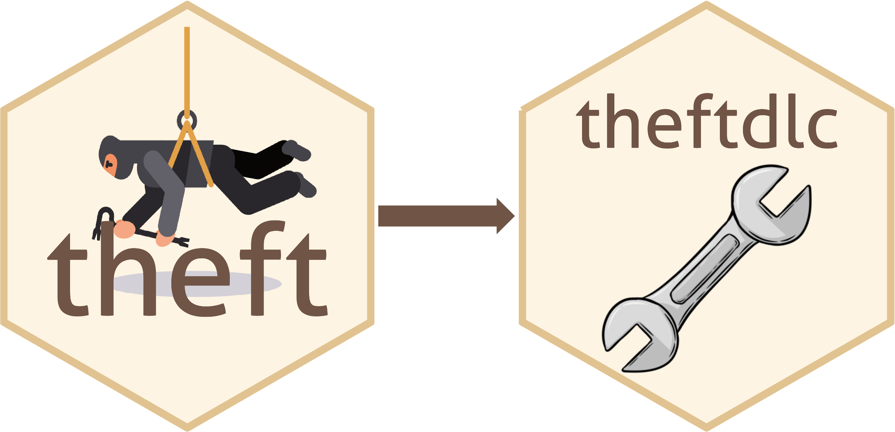
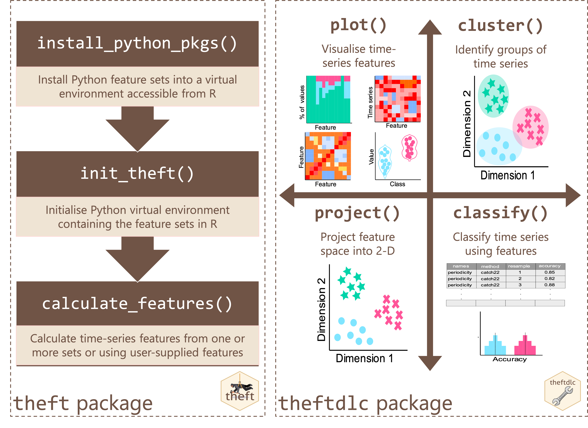
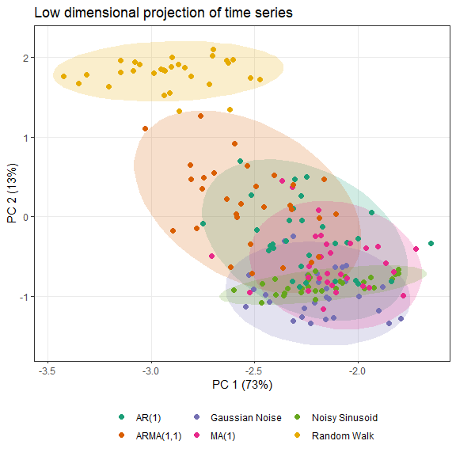

# theft 

[](https://www.r-pkg.org/pkg/theft)
[](https://www.r-pkg.org/pkg/theft)
[](https://zenodo.org/badge/latestdoi/351259952)

Tools for Handling Extraction of Features from Time series (theft)

## Installation

You can install the stable version of `theft` from CRAN:

``` r
install.packages("theft")
```

You can install the development version of `theft` from GitHub using the
following:

``` r
devtools::install_github("hendersontrent/theft")
```

Please also check out our paper [Feature-Based Time-Series Analysis in R
using the theft Package](https://arxiv.org/abs/2208.06146) which
discusses the motivation and theoretical underpinnings of `theft` and
walks through all of its functionality using the [Bonn EEG
dataset](https://pubmed.ncbi.nlm.nih.gov/11736210/) — a well-studied
neuroscience dataset.

## General purpose

`theft` is a software package for R that facilitates user-friendly
access to a consistent interface for the extraction of time-series
features. The package provides a single point of access to $>1200$
time-series features from a range of existing R and Python packages. The
packages which `theft` ‘steals’ features from currently are:

- [catch22](https://link.springer.com/article/10.1007/s10618-019-00647-x)
  (R; [see `Rcatch22` for the native implementation on
  CRAN](https://github.com/hendersontrent/Rcatch22))
- [feasts](https://feasts.tidyverts.org) (R)
- [tsfeatures](https://github.com/robjhyndman/tsfeatures) (R)
- [Kats](https://facebookresearch.github.io/Kats/) (Python)
- [tsfresh](https://tsfresh.com) (Python)
- [TSFEL](https://tsfel.readthedocs.io/en/latest/) (Python)

Users can also calculate their own individual features or sets of
features too!

Note that `Kats`, `tsfresh` and `TSFEL` are Python packages. `theft` has
built-in functionality for helping you install these libraries—all you
need to do is install Python on your machine (preferably Python
\>=3.10). If you wish to access the Python feature sets, please run
`?install_python_pkgs` in R after downloading `theft` or consult the
vignette in the package for more information. For a comprehensive
comparison of these six feature sets across a range of domains
(including computation speed, within-set feature composition, and
between-set feature correlations), please refer to the paper [An
Empirical Evaluation of Time-Series Feature
Sets](https://ieeexplore.ieee.org/document/9679937).

As of `v0.6.1`, users can also supply their own features to `theft` (see
the vignette for more information)!

## Package extensibility

The companion package
[`theftdlc`](https://github.com/hendersontrent/theftdlc) (‘`theft`
downloadable content’—just like you get [DLCs and
expansions](https://en.bandainamcoent.eu/elden-ring/elden-ring/shadow-of-the-erdtree)
for video games) contains an extensive suite of functions for analysing,
interpreting, and visualising time-series features calculated from
`theft`. Collectively, these packages are referred to as the ‘`theft`
ecosystem’.



A high-level overview of how the `theft` ecosystem for R is typically
accessed by users is shown below. Note that prior to `v0.6.1` of, many
of the `theftdlc` functions were contained in `theft` but under other
names. To ensure the `theft` ecosystem is as user-friendly as possible
and can scale to meet future demands, `theft` has been refactored to be
just feature extraction, while `theftdlc` handles all the analysis of
the extracted features. The deprecated names—such as
`tsfeature_classifier()` being the outdated version of `classify()`—are
also still available for now in `theftdlc`.



Many more functions and options for customisation are available within
the packages and users are encouraged to explore the vignettes and
helper files for more information.

## Quick tour

`theft` and `theftdlc` combine to create an intuitive and efficient tidy
feature-based workflow. Here is an example of a single code chunk that
calculates features using
[`catch22`](https://github.com/hendersontrent/Rcatch22) and a custom set
of mean and standard deviation, and projects the feature space into an
interpretable two-dimensional space using principal components analysis:

``` r
library(dplyr)
library(theft)
library(theftdlc)

calculate_features(data = theft::simData, 
                   group_var = "process", 
                   feature_set = "catch22",
                   features = list("mean" = mean, "sd" = sd)) %>%
  project(norm_method = "RobustSigmoid",
          unit_int = TRUE,
          low_dim_method = "PCA") %>%
  plot()
```

<!-- -->

In that example, `calculate_features` comes from `theft`, while
`project` and the `plot` generic come from `theftdlc`.

Similarly, we can perform time-series classification using a similar
simple workflow to compare the performance of `catch22` against our
custom set of the first two moments of the distribution:

``` r
calculate_features(data = theft::simData, 
                   group_var = "process", 
                   feature_set = "catch22",
                   features = list("mean" = mean, "sd" = sd)) %>%
  classify(by_set = TRUE,
           n_resamples = 5,
           use_null = TRUE) %>%
  compare_features(by_set = TRUE,
                   hypothesis = "null") %>%
  head()
```

                    hypothesis  feature_set   metric  set_mean null_mean
    1 All features != own null All features accuracy 0.8400000 0.1688889
    2         User != own null         User accuracy 0.7066667 0.1111111
    3      catch22 != own null      catch22 accuracy 0.7066667 0.1600000
      t_statistic      p.value
    1    9.089132 0.0008124621
    2    5.512023 0.0052862976
    3    7.363817 0.0018119523

In this example, `classify` and `compare_features` come from `theftdlc`.

Please see the vignette for more information and the full functionality
of both packages.

## Citation

If you use `theft` or `theftdlc` in your own work, please cite both the
paper:

T. Henderson and Ben D. Fulcher. [Feature-Based Time-Series Analysis in
R using the theft Package](https://arxiv.org/abs/2208.06146). arXiv,
(2022).

and the software:


    To cite package 'theft' in publications use:

      Trent Henderson (2025). theft: Tools for Handling Extraction of
      Features from Time Series. R package version 0.7.1.
      https://hendersontrent.github.io/theft/

    A BibTeX entry for LaTeX users is

      @Manual{,
        title = {theft: Tools for Handling Extraction of Features from Time Series},
        author = {Trent Henderson},
        year = {2025},
        note = {R package version 0.7.1},
        url = {https://hendersontrent.github.io/theft/},
      }


    To cite package 'theftdlc' in publications use:

      Trent Henderson (2024). theftdlc: Analyse and Interpret Time Series
      Features. R package version 0.1.2.
      https://CRAN.R-project.org/package=theftdlc

    A BibTeX entry for LaTeX users is

      @Manual{,
        title = {theftdlc: Analyse and Interpret Time Series Features},
        author = {Trent Henderson},
        year = {2024},
        note = {R package version 0.1.2},
        url = {https://CRAN.R-project.org/package=theftdlc},
      }
