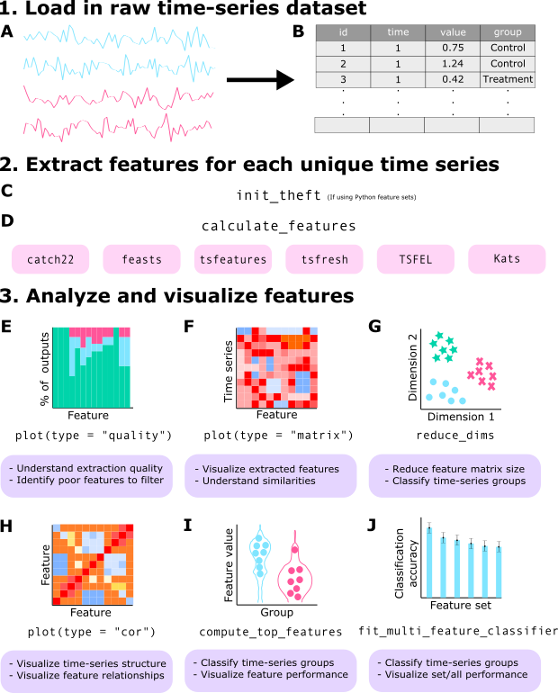

  
```{r, include = FALSE}
knitr::opts_chunk$set(
  collapse = TRUE,
  comment = "#>",
  fig.height = 8,
  fig.width = 8,
  warning = FALSE,
  fig.align = "center"
)
```

```{r setup, message = FALSE, warning = FALSE}
library(theft)
```

## Purpose

`theft` facilitates user-friendly access to a structured analytical workflow for the extraction, analysis, and visualisation of time-series features. This structured workflow is presented in the graphic below (note that `theft` has many more functions than displayed in this graphic --- keep reading for more):



## Core calculation functions

To explore package functionality, we are going to use a dataset that comes standard with `theft` called `simData`. This dataset contains a collection of randomly generated time series for six different types of processes. The dataset can be accessed via:
  
```{r, message = FALSE, warning = FALSE, eval = FALSE}
theft::simData
```

The data follows the following structure:
  
```{r, message = FALSE, warning = FALSE}
head(simData)
```

### Calculating feature summary statistics

The core function that automates the calculation of the feature statistics at once is `calculate_features`. You can choose which subset of features to calculate with the `feature_set` argument. The choices are currently `"catch22"`, `"feasts"`, `"Kats"`, `"tsfeatures"`, `"tsfresh"`, and/or `"TSFEL"`.

Note that `Kats`, `tsfresh` and `TSFEL` are Python packages. The R package `reticulate` is used to call Python code that uses these packages and applies it within the broader *tidy* data philosophy embodied by `theft`. At present, depending on the input time-series, `theft` provides access to $>1200$ features. Prior to using `theft` (only if you want to use the `Kats`, `tsfresh` or `TSFEL` feature sets - the R-based sets will run fine) you should have a working Python installation and download `Kats` using the instructions located [here](https://facebookresearch.github.io/Kats/), `tsfresh` [here](https://tsfresh.com) or `TSFEL` [here](https://github.com/fraunhoferportugal/tsfel).

Here is an example with the `catch22` set:
  
```{r, message = FALSE, warning = FALSE}
feature_matrix <- calculate_features(data = simData, 
                                     id_var = "id", 
                                     time_var = "timepoint", 
                                     values_var = "values", 
                                     group_var = "process", 
                                     feature_set = "catch22",
                                     seed = 123)
```

Note that for the `catch22` set you can set the additional `catch24` argument to calculate the mean and standard deviation in addition to the standard 22 features:
  
```{r, message = FALSE, warning = FALSE, eval = FALSE}
feature_matrix <- calculate_features(data = simData, 
                                     id_var = "id", 
                                     time_var = "timepoint", 
                                     values_var = "values", 
                                     group_var = "process", 
                                     feature_set = "catch22",
                                     catch24 = TRUE,
                                     seed = 123)
```

Note that if you want to use any of the Python-based packages, you must first tell R (prior to running `calculate_features`) which Python and virtual environment on your computer contains the installed libraries. This can be done via the `init_theft` function, which has two arguments:

1. `python_path` --- string specifying the filepath to the version of Python you wish to use
1. `venv_path` --- string specifying the filepath to the Python virtual environment where `tsfresh`, `TSFEL`, and/or `Kats` are installed

**NOTE: You only need to call ** `init_theft` **once per session.**

A tidy dataframe of *most* of the included features and the set they correspond to is available in the dataframe `feature_list`:
  
```{r, message = FALSE, warning = FALSE}
head(feature_list)
```

NOTE: If using the `tsfresh` feature set, you might want to consider the `tsfresh_cleanup` argument to `calculate_features`. This argument defaults to `FALSE` and specifies whether to use the in-built `tsfresh` relevant feature filter or not.

For a detailed comparison of the six feature sets, see [this paper](https://ieeexplore.ieee.org/document/9679937) for a detailed review^[T. Henderson and B. D. Fulcher, "An Empirical Evaluation of Time-Series Feature Sets," 2021 International Conference on Data Mining Workshops (ICDMW), 2021, pp. 1032-1038, doi: 10.1109/ICDMW53433.2021.00134.].

## Data quality checks

The `calculate_features` function returns an object of class `feature_calculations`. Objects of this type are purposefully looked-for by other functions in `theft`. Because it is a class, simple methods such as `plot()` can be called on the object to produce a range of statistical graphics. The first is a visualisation of the data types of the calculated feature vectors. This is useful for inspecting which features might need to be dropped due to large proportions of undesirable (e.g., `NA`, `NaN` etc.) values. We can specify the plot `type = "quality` to make this graphic:

```{r, message = FALSE, warning = FALSE}
plot(feature_matrix, type = "quality")
```

## Normalising/scaling functions

Putting calculated feature vectors on an equal scale is crucial for any statistical or machine learning model as variables with high variance can adversely impact the model's capacity to fit the data appropriately, learn appropriate weight values, or minimise a loss function. `theft` includes function `normalise` to rescale either the whole `feature_calculations` object, or a single vector of values (e.g. values for all participants on just the `SB_BinaryStats_mean_longstretch1` feature). Four normalisation methods are offered:

* z-score - `"z-score"`
* Sigmoid - `"Sigmoid"`
* Outlier-robust Sigmoid (credit to Ben Fulcher for creating the original [MATLAB version](https://github.com/benfulcher/hctsa)) - `"RobustSigmoid"`
* Min-max - `"MinMax"`

Normalisation on the whole `feature_calculations` object can be performed in one line:

```{r, message = FALSE, warning = FALSE}
normed <- normalise(feature_matrix, method = "z-score")
```

For single vector normalisation, all you need to do is pass in a vector as `normalise` checks for object classes.

## Data visualisation and low-dimensional project functions

The package also comes with additional statistical and graphical functionality:

* Feature by time-series matrix as a heatmap
* Low dimensional projections of the feature space and plotting as a scatterplot
* Pairwise feature correlation matrix as a heatmap

### Feature matrices

The function calling `type = "matrix"` in `plot()` on a `feature_calculations` object takes itand produces a `ggplot` object heatmap showing the feature vectors across the `x` axis and each time series down the `y` axis. Prior to plotting, the function hierarchically clusters the data across both rows and columns to visually highlight the empirical structure. Note that you have several options for the hierarchical clustering linkage algorithm to use:

* `"average"` (default)
* `"ward.D"`
* `"ward.D2"`
* `"single"`
* `"complete"`
* `"mcquitty"`
* `"median"`
* `"centroid"`

See the [`hclust` documentation](https://www.rdocumentation.org/packages/stats/versions/3.6.2/topics/hclust) for more information.

Note that the legend for this plot (and other matrix visualisations in `theft`) have been discretised for visual clarity as continuous legends can be difficult to interpret meaningful value differences easily.

```{r, message = FALSE, warning = FALSE}
plot(feature_matrix, type = "matrix")
```

You can control the normalisation type with the `method` argument and the hierarchical clustering method with the `clust_method` argument (the example above used defaults so manual specification was not needed).

### Low dimensional projections

The function `reduce_dims` takes the `feature_calculations` object and calculates either a principal components analysis (PCA) or *t*-distributed stochastic neighbour embedding (*t*-SNE) fit on it. This result is stored in a custom object class called `low_dimension`:

```{r, message = FALSE, warning = FALSE}
low_dim <- reduce_dims(feature_matrix, 
                       method = "RobustSigmoid", 
                       low_dim_method = "PCA", 
                       seed = 123)
```

We can similarly call `plot()` on this object to produce a two-dimensional scatterplot of the results:

```{r, message = FALSE, warning = FALSE}
plot(low_dim)
```

Alternatively, a *t*-SNE version can be specified in a similar fashion, with the `perplexity` hyperparameter able to be controlled by the user. Typical values for this range between 5 and 50, depending on the size of the data. At lower levels of `perplexity`, local variations tend to dominate, while at very high levels of `perplexity`, results can be uninterpretable as clusters can merge. See [this interactive article](https://distill.pub/2016/misread-tsne/) for a detailed review.

```{r, message = FALSE, warning = FALSE}
low_dim2 <- reduce_dims(feature_matrix, 
                        method = "RobustSigmoid", 
                        low_dim_method = "t-SNE", 
                        perplexity = 10,
                        seed = 123)

plot(low_dim2)
```

### Pairwise correlations

One can also plot correlations between feature vectors using `plot(type = "cor")` on a `feature_calculations` object:

```{r, message = FALSE, warning = FALSE}
plot(feature_matrix, type = "cor")
```

Similarly, you can control the normalisation type with the `method` argument and the hierarchical clustering method with the `clust_method` argument (the example above used defaults so manual specification was not needed).

## Time-series classification

### Feature-by-feature

Since feature-based time-series analysis has shown particular promise for classification problems, `theft` includes functionality for exploring group separation in addition to the low dimensional representation. The `compute_top_features` function takes a `feature_calculations` object and performs the following:

1. Processes the data ready for analysis
2. Computes a classification algorithm or statistical model on the entire input dataframe
3. Extracts individual feature performance from the classification algorithm using a designated performance metric
4. Filters the feature data to the top `n` performing features (where `n` is specified by the user)
5. Plots a feature $\times$ feature correlation matrix as a heatmap for the top performing features
6. Plots a group of violin plots coloured by class label for the top performing features

This analysis is useful because it can help guide researchers toward more efficient and appropriate interpretation of high-performing features (if any exist) and helps protect against over-interpretation of feature values.

This function returns an object with three components to summarise the above steps:

1. `ResultsTable` -- a dataframe containing feature names, feature set membership, and performance statistics for the top performing features
2. `FeatureFeatureCorrelationPlot` -- a `ggplot` containing the pairwise correlations between top performing features represented as a heatmap
3. `ViolinPlots` -- a `ggplot` containing a matrix of violin plots showing class discrimination by feature

The code below produces analysis for a multiclass problem using a Gaussian process classifier with a radial basis function kernel. It implements a custom "empirical null" procedure for estimating a *p*-value based on classification accuracy of the real data compared to a distribution of null samples built from classification accuracies of the same data but with random class label shuffles. This is also known as permutation testing (see [this document](https://faculty.washington.edu/kenrice/sisg/SISG-08-06.pdf)^[Rice, Ken & Lumley, Thomas. (2008) "Permutation tests"] for a good overview). Note that higher numbers of permutation samples means that a better empirical null distribution can be generated. It is recommended to run 100-1000 permutations, though this comes with considerable computation time. We'll enable a [k-fold cross-validation](https://en.wikipedia.org/wiki/Cross-validation_(statistics)) procedure too for good measure. Note that using these procedures increases the computation time. Electing to not use an empirical null will be faster, but top features will be determined based off classification accuracy of features and not *p*-values. Further, when `use_k_fold = FALSE`, the model will instead be fit on all data and predict classes based off the same data (in `caret` language, this is equivalent to `caret::trainControl(method = "none")` and then calling `predict` on the input data and getting accuracy from the confusion matrix between the two). This will very likely lead to overfitting, but will return results orders of magnitude faster than if `use_k_fold = TRUE`.

Importantly, the argument `null_testing_method` has two choices:
  
  1. `ModelFreeShuffles` -- Generates `num_permutations` number of random shuffles of group labels and computes the proportion that match, returning a distribution of "accuracies". This model is extremely fast as it involves no null model fitting
2. `NullModelFits` -- Generates `num_permutations` number of models that are trained and tested on data where the class label is shuffled. This method is slow but fits separate null models for each `num_permutations` shuffle

We we only use `ModelFreeShuffles` throughout this tutorial to reduce computation time.

`p_value_method` also has two choices:
  
1. `empirical` -- calculates the proportion of null classification accuracies that are equal to or greater than the main model accuracy
2. `gaussian` -- calculates mean and standard deviation of the null distribution to analytically calculate *p*-value for main model against. Initial package testing indicated that the null distributions (especially for increasing `num_permutations`) were approximately Gaussian, meaning this approach can be feasibly used

Note that `ModelFreeShuffles` is incompatible with `pool_empirical_null = TRUE` as the null distributions would be exactly the same. Further, if you set `pool_empirical_null = TRUE` this will compute statistical analysis for each feature against the entire pooled empirical null classification results of all features. Setting it to `FALSE` will compute a *p*-value for each feature against only its empirical null distribution.

**IMPORTANT NOTE:** `theft` currently does not label any results as "statistically significant". If you intend to in your work, please adjust for multiple comparisons when considering numerous results against a threshold (e.g., $\alpha = 0.05$) and ensure any decisions you make are grounded in careful thought.

The `seed` argument allows you to specify a number to fix R's random number generator for reproducible results. It defaults to `123` if nothing is provided.

```{r, message = FALSE, warning = FALSE, eval = FALSE}
outputs <- compute_top_features(feature_matrix, 
                                num_features = 10, 
                                normalise_violin_plots = FALSE,
                                method = "RobustSigmoid",
                                cor_method = "pearson",
                                test_method = "gaussprRadial",
                                clust_method = "average",
                                use_balanced_accuracy = FALSE,
                                use_k_fold = TRUE,
                                num_folds = 10,
                                use_empirical_null =  TRUE,
                                null_testing_method = "ModelFreeShuffles",
                                p_value_method = "gaussian",
                                num_permutations = 10,
                                pool_empirical_null = FALSE,
                                seed = 123)
```

Each component is named and can be accessed through regular use of the `$` operator or through list indexing (both return the same object). Here's the top few rows:

```{r, message = FALSE, warning = FALSE, echo = FALSE}
load("outputs.rda")
```

```{r, message = FALSE, warning = FALSE, eval = FALSE}
head(outputs$ResultsTable)
```

The feature-feature correlation plots are accessed as the second object:

```{r, message = FALSE, warning = FALSE, eval = FALSE}
print(outputs$FeatureFeatureCorrelationPlot)
```

The violin plots are accessed as the third object:

```{r, message = FALSE, warning = FALSE, eval = FALSE}
print(outputs$ViolinPlots)
```

For two-class problems, users can fit statistical models to directly compute *p*-values by specifying one of the following models as the string argument to `test_method`: `"t-test"`, `"wilcox"` or `"BinomialLogistic"`. `theft` has special procedures for these three options if a two-class problem is registered and thus none of the function arguments pertaining to empirical null testing or classification model parameters are used. For multiclass problems (and binary), users can specify any model name string that is a valid `method` name in the popular [`caret`](https://topepo.github.io/caret/train-models-by-tag.html) package and `theft` will pass this through to the relevant sub-procedures which will make use of the arguments relating to *k*-fold cross-validation, permutation testing, and *p*-value calculation.

### Multi-feature

A multi-feature option is also available. The `fit_multivariable_classifier` function fits all features in the `feature_calculations` object at once instead of by individual features to estimate classification accuracy. This can be split by feature set (if the `by_set` argument is set to `TRUE`) to enable systematic comparisons between those made available in `theft`. To save computation time in this tutorial, we will only analyse `catch22` (with `by_set = TRUE` to demonstrate automated plotting functionality), but comparing multiple calculated feature sets is recommended in practice.

Now we can use our multi-feature functionality (note the similarity in options to the single feature version we specified above):

```{r, message = FALSE, warning = FALSE, eval = FALSE}
multi_outputs <- fit_multi_feature_classifier(feature_matrix, 
                                              id_var = "id", 
                                              group_var = "group", 
                                              by_set = TRUE, 
                                              test_method = "svmLinear",
                                              use_balanced_accuracy = TRUE,
                                              use_k_fold = TRUE,
                                              num_folds = 10,
                                              use_empirical_null =  TRUE,
                                              null_testing_method = "ModelFreeShuffles",
                                              p_value_method = "gaussian",
                                              num_permutations = 10,
                                              seed = 123)
```

We can now access the various named objects returned by this function, which include:

1. `FeatureSetResultsPlot` (only if `by_set` is set to `TRUE`) -- a `ggplot` displaying classification accuracy (or balanced classification accuracy if `use_balanced_accuracy` is set to `TRUE`) by feature set
2. `TestStatistics` -- a dataframe containing a summary of test statistics (and *p*-values if `use_empirical_null` is set to `TRUE`)
3. `RawClassificationResults` -- a dataframe containing classification accuracies results from each main and null prediction

Here's the feature set comparison plot (note that because we have balanced classes, in this case, accuracy $=$ balanced accuracy; and because we only calculated features for `catch22`, the accuracy for `"All features"` $=$ accuracy for `catch22`):

```{r, message = FALSE, warning = FALSE, echo = FALSE}
load("multi_outputs.rda")
```
  
```{r, message = FALSE, warning = FALSE, eval = FALSE}
print(multi_outputs$FeatureSetResultsPlot)
```

Here's the test statistics summary:

```{r, message = FALSE, warning = FALSE, eval = FALSE}
head(multi_outputs$TestStatistics)
```

And here's the raw classifier results:
  
```{r, message = FALSE, warning = FALSE, eval = FALSE}
head(multi_outputs$RawClassificationResults)
```

Note that for the multi-feature version, only valid `caret` method names are able to be used to specify a `test_method`.

## Reading and processing hctsa-formatted files

As `theft` is based on the foundations laid by [`hctsa`](https://github.com/benfulcher/hctsa), there is also functionality for reading in `hctsa`-formatted Matlab files and automatically processing them into tidy dataframes ready for feature extraction in `theft`. The `process_hctsa_file` function takes a string filepath to the Matlab file and does all the work for you, returning a dataframe with naming conventions consistent with other `theft` functionality. As per `hctsa` specifications for [Input File Format 1](https://hctsa-users.gitbook.io/hctsa-manual/calculating/input_files), this file should have 3 variables with the following exact names: `timeSeriesData`, `labels`, and `keywords`.  Here is an example using the [Bonn University EEG dataset](https://journals.aps.org/pre/abstract/10.1103/PhysRevE.64.061907)^[Andrzejak, Ralph G., et al. (2001) "Indications of nonlinear deterministic and finite-dimensional structures in time series of brain electrical activity: Dependence on recording region and brain state." Physical Review E 64(6): 061907].

```{r, message = FALSE, warning = FALSE, eval = FALSE}
d2 <- process_hctsa_file("https://cloudstor.aarnet.edu.au/plus/s/6sRD6IPMJyZLNlN/download")
```
